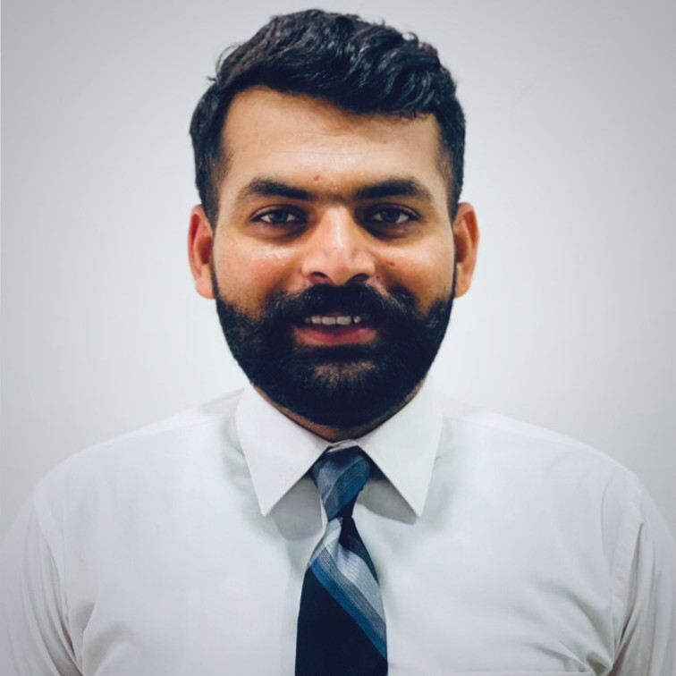

<!-- Hero Banner -->
<!-- 

  

 -->

<!-- Profile Image (Your own image) -->

# Muhammad Tayyab  
**Azure Solution Architect**  
Architecting Cloud Solutions | Securing Infrastructure | Automating for Impact  

📍 Lahore, Punjab, Pakistan
📧[muhammadtayyab26@outlook.com](mailto:muhammadtayyab26@outlook.com) | 🔗 [LinkedIn](https://www.linkedin.com/in/muhammadtayyab26/)  

## About Me  

  

This engineer automates with precision, architects with vision, and scales with confidence!

I’m **Muhammad Tayyab** — a computer science graduate turned **Azure Solution Architect**, passionate about designing **cloud-first, secure, and scalable platforms**.  
At **Systems Limited**, I design and automate Azure infrastructures for global enterprises, enabling seamless deployments with Terraform and Azure DevOps.  
As a **Microsoft Certified Trainer (MCT)**, I also deliver **technical trainings and workshops**, helping professionals and teams adopt Azure best practices with confidence.

## Experience  

  

- **Azure SME | Mashreq Bank**  
   Leading DevOps + architecting pipelines.  

- **Azure Cloud Engineer | Infront Consultancy**
   Azure Infra Management and Deployment using Terraform.  

- **DevOps Engineer | Music Tribe**  
   Azure Infra Management and Automation.  

- **Azure Cloud Engineer | United Nations Relief and Work Agency**  
   UN Agency Cloud Migration, Infrastructure Optimization, implementation of Intune and IAC.
   
- **Azure Cloud Engineer | Team Viewer**  
   Azure Environment Optimization.

- **Azure Cloud Engineer | K-Electric**  
   Migration from On-premises to Azure and across Tenants.

- **Azure Cloud Engineer | Al-Karam Galleria**  
   E-Commerce Platform Rehosting from AWS to Azure

## Skills  

  

**Cloud & Microservice**: Azure, Azure Kubernetes Service  
**DevOps and IAC**: Azure Devops, Terraform   
**Soft Skills**: Mentorship, Trainer, Problem Solving  

## Certifications  

  

- MCT - Microsoft Certified Trainer 
- AZ-104 - Microsoft Azure Administrator  
- AZ-700 - Microsoft Network Associate
- Az-900 - Azure Fundamentals
- SC-900 - Microsoft Security, Compliance and Identity
- HashiCorp Certified: Terraform-Associate-003

## Contact  

  

📧 [muhammadtayy26@outlook.com](mailto:muhammadtayyab26@outlook.com)  
🔗 [LinkedIn](https://www.linkedin.com/in/muhammadtayyab26/)  
💻 [GitHub](https://github.com/MuhammadTayyab26)  
